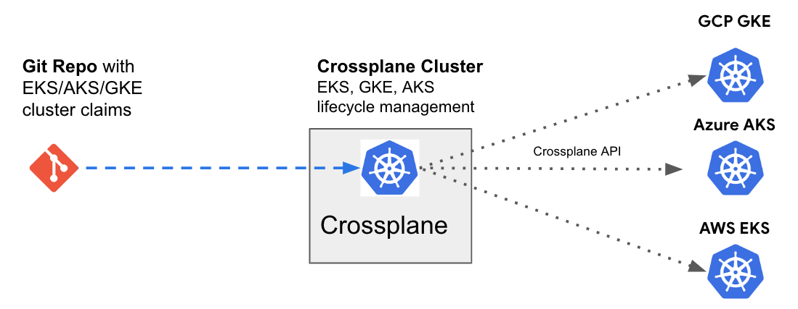

#### Troubleshooting
```sh
kubectl get events -n default --sort-by={'lastTimestamp'}
```

### Install Crossplane
```sh
kubectl create namespace a-team

helm repo add crossplane-stable \
    https://charts.crossplane.io/stable

helm repo update

helm upgrade --install \
    crossplane crossplane-stable/crossplane \
    --namespace crossplane-system \
    --create-namespace \
    --wait
```

#### Create Secrets and Load Providers


**GCP**
You will need to export a service acount key with owner project permissions 

```bash
kubectl --namespace crossplane-system \
    create secret generic gcp-creds \
    --from-file creds=secrets/gcp-creds.json
kubectl apply -f providers/gcp.yaml
```

**AWS**
```bash

export AWS_ACCESS_KEY_ID=[...]
export AWS_SECRET_ACCESS_KEY=[...]

echo "[default]
aws_access_key_id = $AWS_ACCESS_KEY_ID
aws_secret_access_key = $AWS_SECRET_ACCESS_KEY
" | tee aws-creds.conf

kubectl --namespace crossplane-system \
    create secret generic aws-creds \
    --from-file creds=secrets/aws-creds.conf
kubectl apply -f providers/aws.yaml
```
**Azure**

setup subscirption and resource groups
```bash
export subId='xxxx'
export resourceGroup='xxxxx' 

```

Create a secrets file with owner permissions
```bash
   az ad sp create-for-rbac \
--sdk-auth \
--role Owner \
--scopes /subscriptions/$subId
```
Apply Secret and load provider configs
```bash
kubectl --namespace crossplane-system \
    create secret generic azure-creds \
    --from-file creds=./azure-creds.json
kubectl apply -f providers/azure.yaml

```

#### Verify all providers have been installed
This might take a few minutes

```bash
kubectl get providers
```

#### Install Provider Configs
Input your gcp projectID in the gcp-providerconfig.yaml
```bash
kubectl apply -f providers/gcp-providerconfig.yaml
kubectl apply -f providers/azure-providerconfig.yaml
kubectl apply -f providers/aws-providerconfig.yaml
```
#### Apply the Compositions

GKE on GCP
```sh
kubectl apply -f compositions/gcp-gke.yaml
kubectl apply -f compositions/gcp-gke-nodepool.yaml
```

EKS on AWS
```sh
kubectl apply -f compositions/aws-eks.yaml
```

AKS on Azure
```sh
kubectl apply -f compositions/azure-aks.yaml
```

#### Install XRDs
```sh
kubectl apply -f package/xrd.yaml
kubectl apply -f package/xrd-nodepools.yaml

```

#### Create a cluster
```sh
kubectl apply -f claims/cluster.yaml
```
#### Create a cluster from a namespace scoped claim
```sh
kubectl apply -f claims/ns-scoped-claims/cluster-ns-scope.yaml
```
#### View Clusters
cluster scope
```sh
kubectl get compositeclusters
```

ns scope
```sh
kubectl get clusters
```
#### Import an Existing GKE cluster on GCP
You will have to change the external name and location fieds in this file
```sh
kubectl apply -f import/import-gcp-gke.yaml
```


#### View Managed Resources
```
kubectl get manged

```
